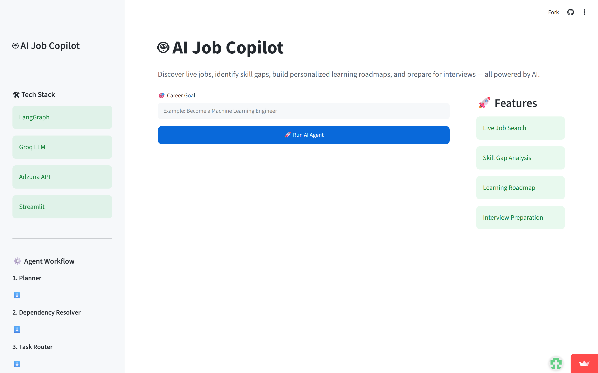
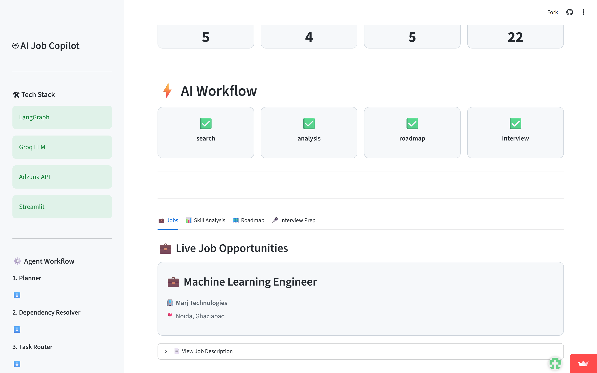
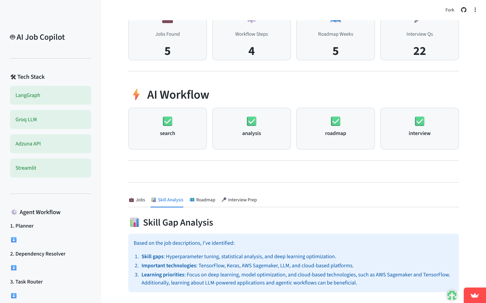
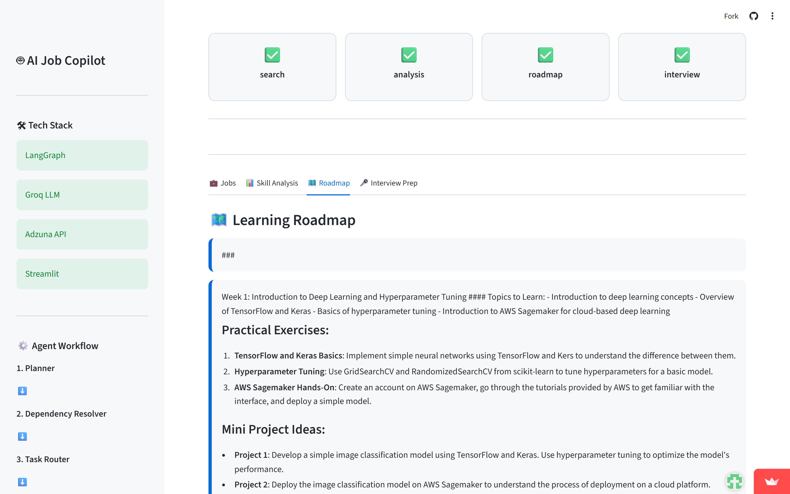
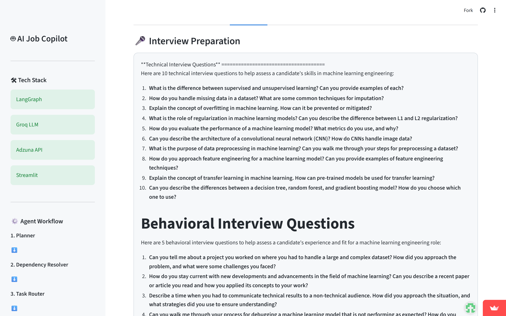
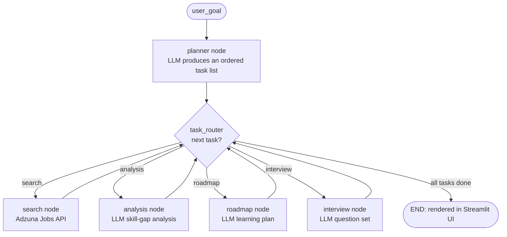

# AI Job Copilot

> An LLM-powered **career copilot** built on **LangGraph**. Give it a career goal; an LLM planner decides which steps to run, then the agent searches **live job listings**, analyzes skill gaps, generates a learning roadmap, and produces interview questions — as an explicit, inspectable state graph, served through a deployed **Streamlit** web app.

### ▶ Live demo: **https://ai-job-copilot-31.streamlit.app/**

<p align="left">
  <a href="https://ai-job-copilot-31.streamlit.app/"></a>
  
  
  
  
  
</p>

## Screenshots

Enter a career goal and the agent plans its steps, searches **real jobs (Adzuna)**, and generates tailored guidance — live:



| Live job search (real Adzuna listings) | Skill-gap analysis |
| :---: | :---: |
|  |  |
| **Learning roadmap** | **Interview preparation** |
|  |  |

> ▶ Try it live: **[ai-job-copilot-31.streamlit.app](https://ai-job-copilot-31.streamlit.app/)**

---

## Overview

**AI Job Copilot** turns a single career goal ("Find Python jobs and build me a roadmap") into a set of coordinated LLM steps. Rather than one giant prompt, it's a **LangGraph state machine**: a planner node reads your goal and decides which tasks are needed, and a router then drives the agent through only those tasks. Every step reads and writes a shared, typed state object, so the run is explicit and inspectable — and the whole thing runs behind a modular Streamlit UI you can try live above.

It fetches **real job listings from the Adzuna API** and reasons over them with **Groq** (Llama-3.3-70B) via LangChain's OpenAI-compatible client.

## The problem

Preparing for a job search is fragmented: you hunt for roles on one site, figure out skill gaps somewhere else, cobble together a study plan, and separately drill interview questions. Each step is manual and none share context. A naive "one big prompt" LLM approach can't adapt — it does the same thing regardless of what you asked.

## The solution

Model the workflow as an **agent graph** that plans before it acts:

- **Plans dynamically.** An LLM planner parses your goal into an ordered task list (`search`, `analysis`, `roadmap`, `interview`) — you only run the steps you need.
- **Acts on real data.** The search node calls the **Adzuna Jobs API** and returns live roles (title, company, location, description).
- **Shares context.** A typed `AgentState` carries results between steps, so interview questions build on the roadmap, which builds on the skill-gap analysis, which builds on the retrieved jobs.
- **Is usable.** A deployed Streamlit interface renders each stage — job cards, analysis, roadmap, and interview prep.

## Features

| Capability | How it works | Status |
|---|---|---|
| **Dynamic task planning** | LLM planner turns a goal into an ordered task list | ✅ Live |
| **Live job search** | Real listings via the **Adzuna Jobs API** | ✅ Live |
| **Skill-gap analysis** | LLM identifies gaps, key technologies, priorities | ✅ Live |
| **Learning roadmap** | LLM generates a structured plan | ✅ Live |
| **Interview questions** | LLM produces technical + behavioral questions | ✅ Live |
| **Conditional routing** | `task_router` dispatches through the planned tasks | ✅ Live |
| **Typed agent state** | `TypedDict` shared across all nodes | ✅ Live |
| **Streamlit web UI** | Modular renderers (`ui/`), deployed to Streamlit Cloud | ✅ Live |
| **Groq / Llama-3.3-70B** | via LangChain OpenAI-compatible client | ✅ Live |

## Architecture



**Design notes**
- **State (`state.py`)** — a `TypedDict` (`user_goal`, `jobs_found`, `skill_gap_analysis`, `learning_plan`, `interview_questions`, `tasks`, `task_index`, `next_step`).
- **Graph (`graph.py`)** — wires planner → task_router → task nodes → loop, compiled into a runnable LangGraph app.
- **Tools (`tools.py`)** — `search_jobs` calls the Adzuna API and formats results for the LLM.
- **LLM (`llm.py`)** — the Groq/Llama client, isolated so the provider is swappable.
- **UI (`streamlit_app.py` + `ui/`)** — modular renderers for the sidebar, header, job cards, analysis, roadmap, and interview sections.

## Tech stack

| Layer | Choice |
|---|---|
| Language | Python 3.11+ |
| Agent framework | LangGraph |
| LLM client | LangChain (`langchain-openai`) |
| Model / inference | Groq — `llama-3.3-70b-versatile` |
| Job data | Adzuna Jobs API |
| UI / hosting | Streamlit + Streamlit Community Cloud |
| Tests / CI | pytest + GitHub Actions |

## Folder structure

```
ai-job-copilot/
├── streamlit_app.py     # Streamlit entry point (the deployed app)
├── app.py               # CLI entry point
├── graph.py             # Nodes + routing, compiled into the LangGraph app
├── state.py             # Typed AgentState
├── llm.py               # Groq/Llama client
├── tools.py             # search_jobs — Adzuna Jobs API integration
├── planner_utils.py     # planner helpers
├── ui/                  # modular Streamlit renderers
│   ├── sidebar.py  header.py  metrics.py  workflow.py
│   ├── jobs.py     analysis.py  roadmap.py  interview.py  styles.py
├── tests/test_routing.py   # offline routing tests
├── .streamlit/config.toml  # Streamlit theme/config
├── requirements.txt · pytest.ini · LICENSE
└── .github/                # CI + issue/PR templates
```

## Try it

**Live:** open **https://ai-job-copilot-31.streamlit.app/** — enter a goal (e.g. *"Find Python jobs and prepare me for interviews"*) and run.

**Run locally:**
```bash
git clone https://github.com/DhanushRaj7/ai-job-copilot.git
cd ai-job-copilot
python -m venv .venv && .venv\Scripts\Activate.ps1     # macOS/Linux: source .venv/bin/activate
pip install -r requirements.txt

copy .env.example .env          # macOS/Linux: cp .env.example .env
# set GROQ_API_KEY (https://console.groq.com) and ADZUNA_APP_ID / ADZUNA_APP_KEY (https://developer.adzuna.com)

streamlit run streamlit_app.py  # web UI
# or:  python app.py            # CLI
```

**Run the tests:**
```bash
pytest        # offline routing tests, no API keys needed
```

## Future improvements

- [ ] Cache Adzuna results and add rate-limit handling
- [ ] Support more regions/countries and job filters
- [ ] Add an evaluation harness for ranking/answer quality
- [ ] Add observability (LangSmith tracing)
- [ ] Persist sessions / export the generated roadmap

## Lessons learned

- **Plan-then-act beats one big prompt.** An LLM planner choosing the tasks makes the agent adapt to the request instead of doing everything every time.
- **State design is the real design.** A single typed state object lets later steps build on earlier ones.
- **Isolate the model and the tools.** Keeping Groq behind `llm.py` and Adzuna behind `tools.py` made both swappable.
- **Ship the UI.** Wiring the graph into a modular Streamlit app — and deploying it — is what turns an agent into something people can actually use.

## Contributing

Contributions and feedback welcome — see [CONTRIBUTING.md](./CONTRIBUTING.md) and the [Code of Conduct](./CODE_OF_CONDUCT.md).

## License

Released under the [MIT License](./LICENSE).

---

<sub>Built by <a href="https://github.com/DhanushRaj7">Dhanush Raj</a> — a study in production-style agent architecture with LangGraph, deployed end-to-end.</sub>
