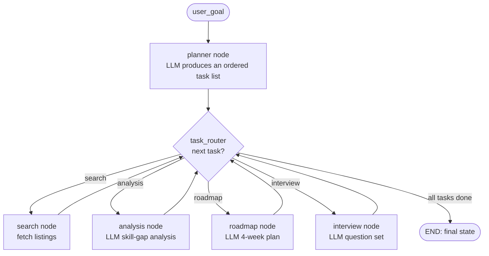

# AI Job Copilot

> An LLM-powered **career copilot** built on **LangGraph**. Give it a career goal; an LLM planner decides which steps to run, then the agent works through them — searching roles, analyzing skill gaps, generating a learning roadmap, and producing interview questions — as an explicit, inspectable state graph.

<p align="left">
  
  
  
  
  
</p>

<!-- A short terminal-run GIF is the highest-impact thing you can add here once recorded:

-->

---

## Overview

**AI Job Copilot** turns a single career goal ("Find Python jobs and build me a roadmap") into a set of coordinated LLM steps. Rather than one giant prompt, it's a **LangGraph state machine**: a planner node reads your goal and decides which tasks are needed, and a router then drives the agent through only those tasks. Every step reads and writes a shared, typed state object, so the run is explicit and inspectable.

It runs on **Groq** (Llama-3.3-70B) through LangChain's OpenAI-compatible client.

## The problem

Preparing for a job search is fragmented work: you hunt for roles on one site, figure out your skill gaps somewhere else, cobble together a study plan, and separately drill interview questions. Each step is manual, and none of them share context. A naive "one big prompt" LLM approach can't adapt — it does the same thing regardless of what you actually asked for.

## The solution

Model the workflow as an **agent graph** that plans before it acts:

- **Plans dynamically.** An LLM planner parses your goal into an ordered list of tasks (`search`, `analysis`, `roadmap`, `interview`) — you only run the steps you need.
- **Routes explicitly.** A router node walks the task list, dispatching to the right node and looping until the plan is complete.
- **Shares context.** A typed `AgentState` carries results between steps, so the interview questions are informed by the roadmap, which is informed by the skill-gap analysis, which is informed by the search results.
- **Stays inspectable.** Because it's a graph, you can see exactly which nodes ran and in what order (each node logs as it executes).

## Features

| Capability | How it works | Status |
|---|---|---|
| **Dynamic task planning** | LLM planner turns a goal into an ordered task list | ✅ Working |
| **Skill-gap analysis** | LLM identifies gaps, key technologies, learning priorities | ✅ Working |
| **Learning roadmap** | LLM generates a structured 4-week plan | ✅ Working |
| **Interview questions** | LLM produces technical + behavioral + follow-up questions | ✅ Working |
| **Conditional routing** | `task_router` dispatches through the planned tasks | ✅ Working |
| **Typed agent state** | `TypedDict` shared across all nodes | ✅ Working |
| **Groq / Llama-3.3-70B** | via LangChain OpenAI-compatible client | ✅ Working |
| **Job search** | currently returns **sample data** — see note below | 🚧 Stubbed |
| **Streamlit UI** | not yet built — runs as a CLI today | 🗺️ Planned |
| **Tests for LLM nodes** | routing is unit-tested; LLM nodes are not yet | 🗺️ Planned |

> **Honest status:** the planning, routing, analysis, roadmap, and interview generation are **real and working** against a live LLM. The **`search_jobs` tool returns hardcoded sample listings** (`tools.py`) — wiring a real jobs API is the top roadmap item. The status column above is the source of truth; nothing here claims to work that doesn't.

## Architecture



**Design notes**
- **State (`state.py`)** — a `TypedDict` (`user_goal`, `jobs_found`, `skill_gap_analysis`, `learning_plan`, `interview_questions`, `tasks`, `task_index`, `next_step`). The single source of truth for a run.
- **Graph (`graph.py`)** — defines every node and wires planner → task_router → task nodes → back to task_router loop, compiled into a runnable LangGraph app.
- **Planner** — the only node that decides *what* to do; keeps branching logic out of the task nodes.
- **LLM (`llm.py`)** — the Groq/Llama client, isolated so the model or provider can be swapped in one place.
- **Tools (`tools.py`)** — external capabilities. `search_jobs` is the extension point for a real jobs API.

## Tech stack

| Layer | Choice |
|---|---|
| Language | Python 3.11+ |
| Agent framework | LangGraph |
| LLM client | LangChain (`langchain-openai`, OpenAI-compatible) |
| Model / inference | Groq — `llama-3.3-70b-versatile` |
| Config | `python-dotenv` |
| Tests | pytest (offline routing tests) |
| CI | GitHub Actions (ruff lint + pytest) |

## Folder structure

```
ai-job-copilot/
├── app.py              # Entry point — sets a goal and invokes the compiled graph
├── graph.py            # Nodes + routing, compiled into the LangGraph app
├── state.py            # Typed AgentState (shared across nodes)
├── llm.py              # Groq/Llama client (provider-isolated)
├── tools.py            # Tools exposed to the agent (search_jobs — currently sample data)
├── tests/
│   └── test_routing.py # Offline unit tests for the routing logic (no network)
├── examples/
│   └── smoke_llm.py    # Manual LLM connectivity check (not run by CI)
├── requirements.txt
├── pytest.ini
├── .env.example        # Copy to .env and add GROQ_API_KEY
├── .github/workflows/ci.yml
├── LICENSE
└── README.md
```

## Installation

**Prerequisites:** Python 3.11+ and a [Groq API key](https://console.groq.com/) (free tier available).

```bash
# 1. Clone
git clone https://github.com/DhanushRaj7/ai-job-copilot.git
cd ai-job-copilot

# 2. Virtual environment
python -m venv .venv
.venv\Scripts\Activate.ps1        # Windows (PowerShell)
# source .venv/bin/activate       # macOS / Linux

# 3. Install
pip install -r requirements.txt

# 4. Configure your key
copy .env.example .env            # Windows  (macOS/Linux: cp .env.example .env)
# then edit .env and set GROQ_API_KEY
```

## Usage

The agent currently runs from the CLI. Set your goal in `app.py` (the `user_goal` field), then:

```bash
python app.py
```

Example goals to try (the planner picks the steps automatically):
- `"Give me React interview questions"` → runs **interview**
- `"Find Python jobs and create a roadmap"` → runs **search → analysis → roadmap**
- `"Analyze the skills I need for an ML engineer role and prep me for interviews"` → runs **analysis → interview**

The final state (with every generated section) is printed at the end of the run.

**Run the tests:**
```bash
pytest                 # offline routing tests, no API key needed
```

## Screenshots

<!-- Add a terminal capture of a full run, and (once built) the Streamlit UI:
     docs/run-cli.png  ·  docs/ui.png  -->

_CLI today; a UI is on the roadmap. A terminal-run screenshot/GIF will live here._

## Future improvements

- [ ] Replace the `search_jobs` stub with a **real jobs API** (e.g. Remotive / Arbeitnow)
- [ ] Add a **Streamlit UI** (goal box + rendered sections)
- [ ] Move the goal out of `app.py` into a CLI argument / input prompt
- [ ] Add **tests for the LLM nodes** using a mocked model
- [ ] Wire structured **tool-calling** instead of a direct function call
- [ ] Add **observability** (LangSmith tracing) to inspect runs
- [ ] **Dockerize** for one-command runs

## Lessons learned

- **Plan-then-act beats one big prompt.** Letting an LLM planner choose the tasks makes the agent adapt to the request instead of doing everything every time.
- **State design is the real design.** A single typed state object is what lets later steps build on earlier ones — most "agent bugs" are really state bugs.
- **Isolate the model.** Keeping Groq behind `llm.py` means switching model or provider is a one-file change.
- **Test the parts that don't need the network.** The routing logic is pure and fast to unit-test; that's where deterministic tests add the most value.

## Contributing

Contributions and feedback welcome — see [CONTRIBUTING.md](./CONTRIBUTING.md) and the [Code of Conduct](./CODE_OF_CONDUCT.md). Use the [issue templates](./.github/ISSUE_TEMPLATE) for bugs and ideas.

## License

Released under the [MIT License](./LICENSE).

---

<sub>Built by <a href="https://github.com/DhanushRaj7">Dhanush Raj</a> as a study in production-style agent architecture with LangGraph.</sub>
